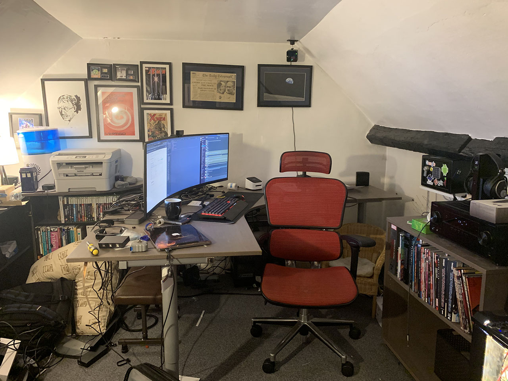
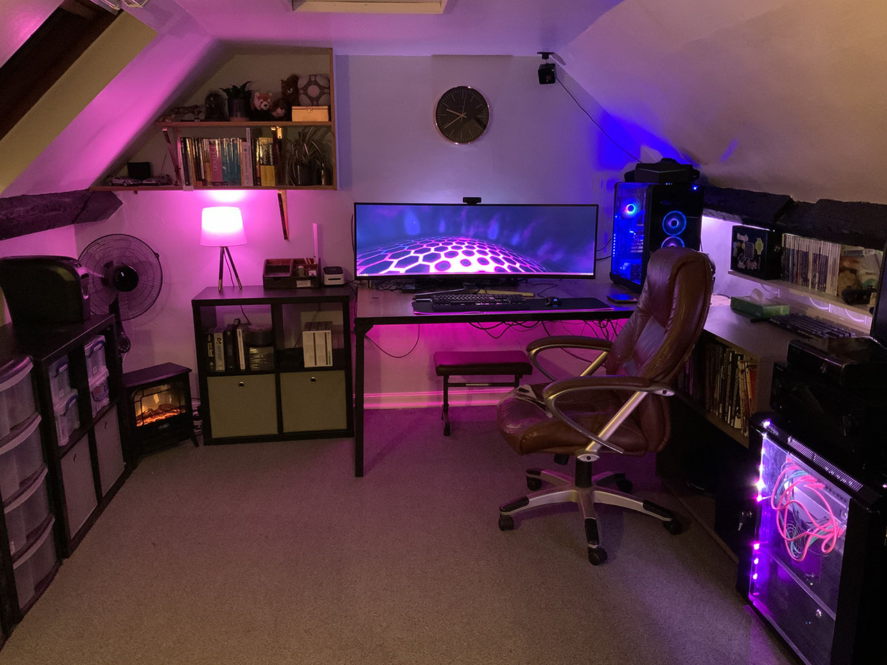

Look at me! I'm doing my how did I do post already and it's only the 2nd of January! That must mean that 2020 is the year I finally start acting like a grown-up, right?

<!-- end -->

## 1) Reach 200lbs: MEGA FAIL!!

I weighed myself when I got up this morning on the off chance that I now weight 200lbs even though I can't fit into last summers t-shirts anymore. No such luck, I currently weigh 258.6lbs which is right up there at the fattest I've ever been (I think my record is somewhere around the 265lb mark.) Gonna rethink this goal for this year, I still want to lose weight but trying to lose 40+ lbs in a year clearly isn't an acheivable goal for me.

## 2) Learn to drive: PASSED!

Amazingly, I passed this one, I took my test in April and passed first time. I got my first car in May and I'm utterly in love!

I want to do my pass-plus this year so I can get my insurance down, I'm a pretty decent driver (although I've got a habit of over-revving the engine), so I think I'll be able to get that done fairly easily.

## 3) Get my bathroom done: FAILED

Our finances took a hit this year as we've made a strong effort to move ourselves out of the debt that buying our house got us into. So we didn't get the money together to get the bathroom done, plus we're indecisive so we kept changing our minds about 'the plan'. We *think* we know what we want now though so hopefully it's gonna happen in 2020.

## 4) Get my office sorted: SUCCESS!!

In 2018 I managed to get to a point where I was working remotely close to 100% of the time (I had to go in once a fortnight). However in 2019, that contract fell-through and I ended up back in a contract which was 60% remote work so my office project stopped being quite so high a priority. Then, just as the year got close to ending, I managed to land an even better contract than last years which actually is 100% remote work, I never have to go into the office as we're a distributed team and there is no office to go into!

So I put my office back on the priority list, I had most of what I needed to get it done and the gap between projects was *just* enough time to do the work.

Here is the 'before' shot:

and here is the glorious 'after' shot:

I still have a few more upgrades to make. I want to mount my server monitor to the shelves to the left of my desk and put some LED lighting in the built-in shelving but all-in-all. I'm incredibly happy with the result.

## 5) Build that wall: FAILED

Same as the bathroom plan, we just didn't end up having the budget for it. Truth be told, we probably could have stretched to this one but we needed a new boiler and spent the money on that, plus we had the boiler relocated to a different part of the house to allow for a pantry and to make way for the eventual bathroom upgrade. Maybe this year.

Keep an eye out for my 2020 goals, coming in the next few days :)