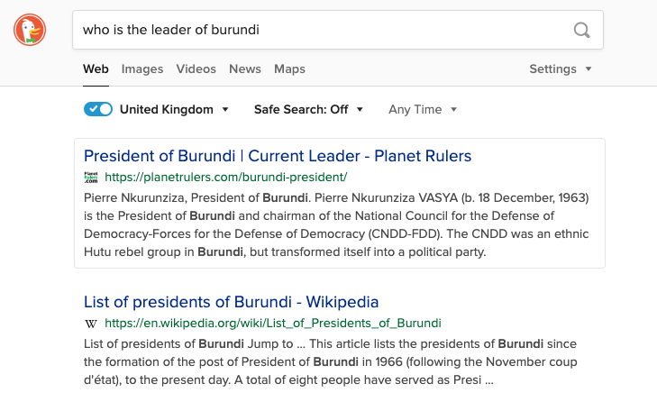
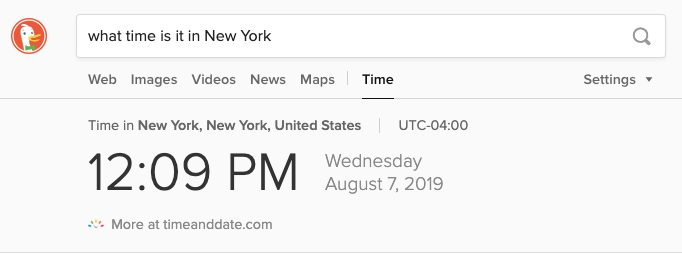
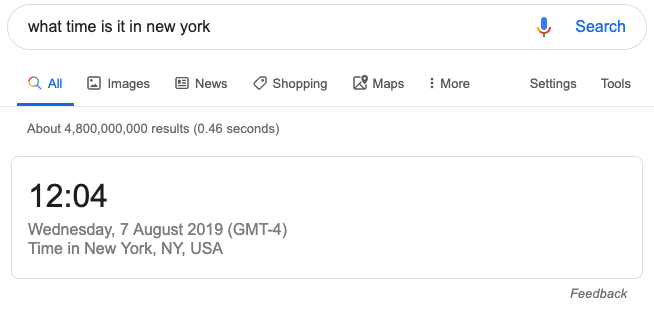

2018 was an eye-opener for me. It was the year that the [Cambridge Analytica](https://www.theguardian.com/uk-news/2018/mar/22/cambridge-analytica-scandal-the-biggest-revelations-so-far) scandal broke and also the year I saw Snowden. However it wasn't until recently that I really felt the urge to 'take back control' and wrestle my privacy rights back. Here's how I've done it.
<!-- end -->

## First, a few excuses.

The three big companies I'm primarily concerned with are Facebook, Amazon and Google. By the end of this journey, I will have removed exactly zero of them from my life.

Why?

Because they are too pervasive online to avoid:

- Amazon has monopolised online ordering and it would take a big shift in that area to make me feel able to let them go completely. Not to mention it's ownership of a lot of server architecture through AWS which - as a web developer - I use extensively (this site is hosted on Netlify which uses AWS as it's backbone).
- Facebook and Instagram (Facebook owned) are the primary means of communication for a lot of people that I know. If I left those platforms I would need to either conciously choose to say goodbye to easy communication with those people or convince them to move to another platform. Unfortunately, the latter is a tough sell as nothing quite comes close to offering what Facebook does.
- Google. Like Amazon, Google pervades the internet and I will be using it in ways I don't even know about. On top of that, I'm a contractor, so I go from company to company and often, they want have access to their company mail server which 90% of the time, is gmail. 

## Why am I doing this?

I've been thinking about it ever since I saw the movie Snowden, however I have recently watched [The Great Hack](https://www.thegreathack.com/) on Netflix and it challenged a misconception I've had for a long time:

My privacy settings only affect me.

Thanks to the insane amount of data Facebook and Google had on each individual, a company called Cambridge Analytica was able to manipulate the results of the Brexit Referendum and the 2016 Presidental election, which means that by allowing these companies to track me, I became a part of the problem. I can't have that so I now need to take steps to make sure they have as little as possible from me going forward.

For more information on this topic, I highly recommend "[The Trouble With Facebook](https://podcasts.apple.com/gb/podcast/making-sense-with-sam-harris/id733163012?i=1000433592238&fbclid=IwAR0ITVmH_Es96L5i9sJEu2YYZL4NCQxZDJiAYo-zJGlMWXQUrs-3k-77HAs)" episode of Sam Harris's 'Making Sense' podcasts.

## Part 1: Browsing the internet

I've taken 2 steps for internet browsing privacy:

### 1. I have said goodbye to Chrome.

I've used Chrome for a very long time and although I've been tempted to leave it before, I've never quite managed it as I always felt the only viable alternatives were Firefox and Safar and there was just something about them that I didn't like. However I have recently discovered a company which builds a privacy focused browser using Chromes engine under the hood.

#### Say hello to Brave.

Brave (https://brave.com/) looks and feels exactly like Chrome, it runs the same Chromium engine underneath so sites look and feel the same way and you can even get all of the same Chrome extensions (one of my major reasons for never leaving).

It's also really fast, according to it's website, it's 8x faster than Chrome and it blocks tracking cookies and ads by default (which is probably one of the reasons it's faster). For you super-privacy nerds out there, it even has a 'TOR' mode built in so if you need more privacy than it's regular 'incognito mode' you can instead select 'New private window with Tor' and you are connectedd to the TOR network!

### 2. I now search the web with DuckDuckGo

One of the primary ways Google tracks what you are doing outside of Chrome is via it's search engine, every search you make is logged and then a tracking cookie follows you around, whilst Brave mitigates most of that, you can ensure that Google has no idea where you are or what you are doing by also switching your search engine to DuckDucKGo (https://duckduckgo.com/spread).

This one comes with a small compromise. Google has two aces up it's sleeve when it comes to search:

#### 1. It has great contextual search results.

If you type something which is a question into google, there is a good chance that instead of giving you a list of websites which may (or may not) provide the answer, it will just provide the answer for you in the results.

For example, if I asked google 'Who is the leader of Barundi', I get this:

Whereas the same search in DuckDuckGo gives me this:

Both engines actually give me the answer in the first result but the data from Google is a lot more useful.

That said, simpler queries such as 'What time is it in New York' actually looks better in DuckDuckGo than google:

#### 2. Google knows you really well

Google has spent years watching you search the internet and it knows what sort of results you'll want to see. DuckDuckGo doesn't track you at all so it never knows what you want to see.

This means that Google search results may sometimes be more useful, however this is a double-edged sword as that means Google's results will also be bias. So I'd call this one a draw.

### 3: It's VPN time

I'm not the paranoid sort, which is why it's taken me so long to get around to this, however there are times where I want to be sure that my data is safe (online banking, hiring assassins etc...) also, if I'm not at home and I'm connected to a public WiFi hotspot, there is no way of knowing if my data is secure.

That's where A VPN comes in. It scrambles your traffic on your computer and sends gibberish across the wires, the company providing the WiFI hotspot, the ISP behind them and anyone who is listening in inbetween has no idea what you are doing as they cannot see any of it. When the traffic hits the VPN's servers, it knows how to unscramble the gibberish and sends it on it's way to it's destination.

You can use this all the time if you like but fair warning, internet via a VPN is a little slower due to the encryption/decryption process and that extra hop to the VPN server. To be honest, I doubt it is worth it most of the time if you are at home looking at pictures of cats but if you're out and about or you are doing something sensitive, it's worth having one on, just in case.

I personally use MullVad (https://www.mullvad.net) as it is 100% private, you pay via Bitcoin and give them no personal details so even they don't know who I am. 

There are plenty of VPN providers out there, at various prices, I'd recommend finding a VPN comparison site and then getting one which has the best security features for a price you can live with. Be warned though, some of them are useless and some are downright nefarious so definitely do your research before choosing one.

### 4: Saying goodbye to single sign on (SSO)

Welcome to my first work-in-progress. This one is gonna hurt. 

When Facebook released Facebook Connect, I was hooked, not having to remember usernames and passwords for sites was amazing and I used it wherever I saw it. Then Google came out with their version and I used that everywhere too.

It's not perfect, sometimes companies implement it badly and I've probably got a few accounts with one company as they have tried to auto-create new accounts for me using my SSO credentials rather than asking me if I want to link to an existing account.

Bad-UX aside though, SSO is another godsend for the likes of Facebook and Google as you are giving them reams of data about you whenver you click that button.

There is no way around this, if I want to maintain my privacy, I need to find every site that I have used Facebook or Google to log in on or linked to and kill that connection. 

Thankfully, Facebook make it quite easy, make sure you are logged in and then visit [this page](facebook.com/settings?tab=applications&apps_only) that will show you every single site you have linked your account with, so it's just a case of going through them one-by-one and removing that connection

Google didn't make it quite as easy and it took me a while to find the information, however, it does exist. 

Make sure you are logged in and then visit https://myaccount.google.com/security, scroll down to 'Third-party apps with account access' and click 'Manage third-party access', then scroll down to 'signing in with Google' and work your way though that list.

After spending about 35 minutes going through my very long list, I decided that this was too much effort and going forward I'm just going to remove SSO connections as I find them.

### 5. Installing a password manager everywhere

SSO makes life a lot easier but thanks to password managers, they are not all that useful anymore. I personally use LastPass (https://lastpass.com/) but again there are many choices out there.

It is important that you use a password manager which you can install on all of your devices, especially if you use their 'generate password' feature otherwise you'll not be able to log into your apps/sites on any device it isn't installed. 

I'd also highly recommend enabling 2 Factor Authentication for extra security. 

---

These changes should make some huge differences but there is still plenty more to do to get your privacy back. Keep your eyes peeled for Part 2: Replacing my cloud services